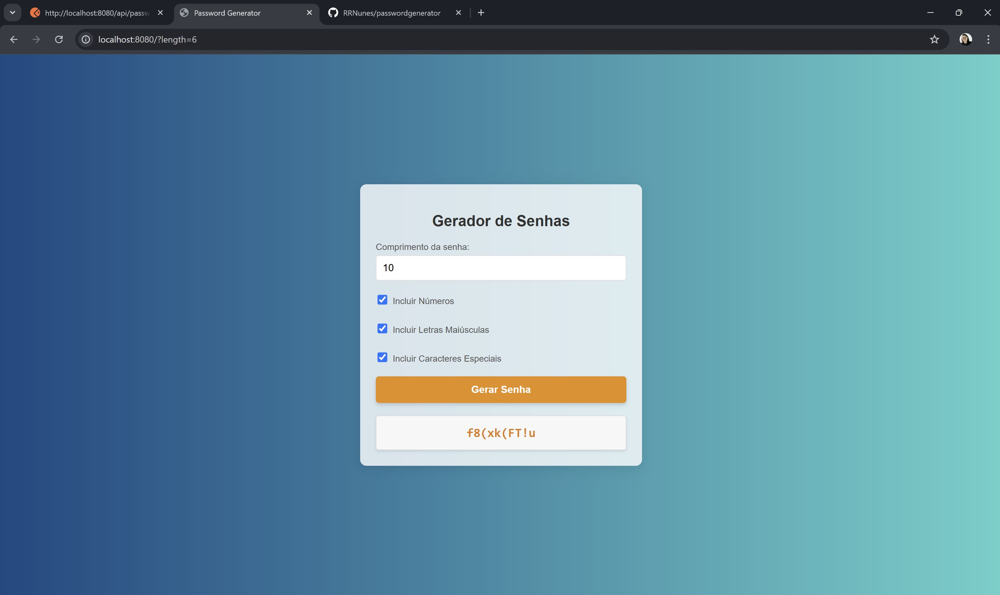

# Gerador de Senha - Projetinho pessoal para fins de estudos

Gerador de Senhas em Java com Interface com HTML, CSS, E JavaScript.

Status: Em progresso...
#### Descrição do Projeto

O projeto é um gerador de senhas seguras utilizando Java, Spring, HTML, CSS, E JavaScript. O gerador permite ao usuário definir parâmetros como comprimento da senha e tipos de caracteres (letras, números, caracteres especiais).
Este projeto é uma aplicação full-stack de gerador de senhas, utilizando Java com Spring Boot no backend e HTML, CSS, E JavaScript no frontend.

## Requisitos

- Java 
- Maven
- HTML E CSS
- JavaScript 

